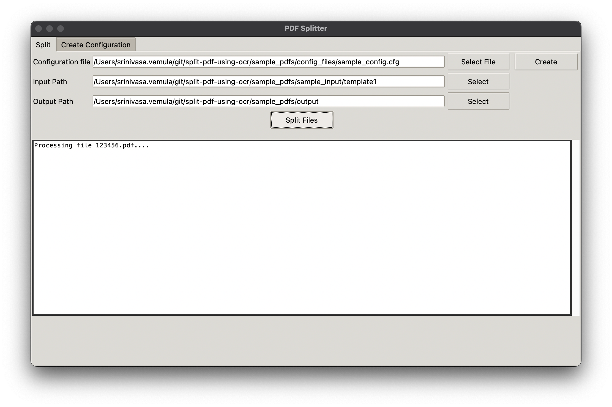
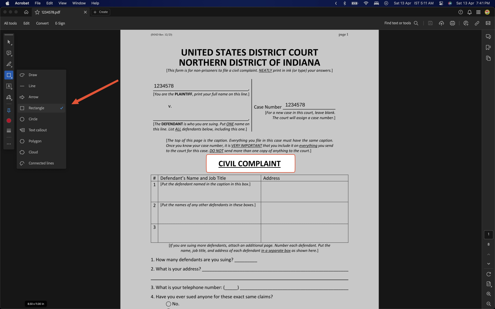
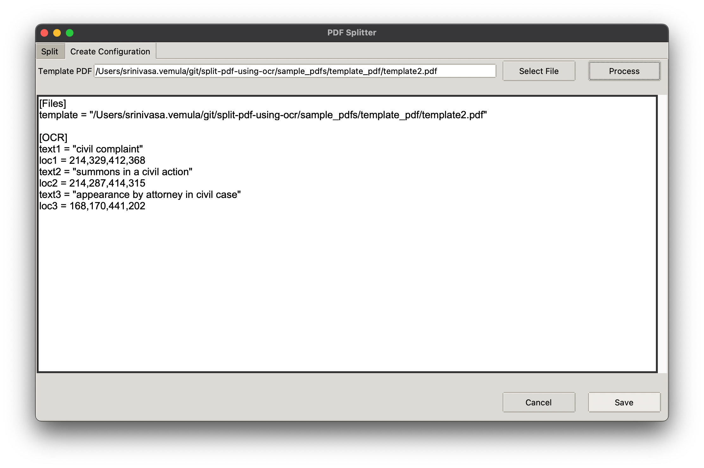

# Split PDF using OCR

[Download PDFSplitter](https://github.com/nikhil-vemula/split-pdf-using-ocr/releases/download/v0.1/PDFSplitter.exe)

## Youtube Video

Link: https://www.youtube.com/watch?v=V7wUBW-en-4

## Contents

- [Problem Statement](#problem-statement)
- [Team](#team)
- [Features](#features)
- [Technical Details](#technical-details)
- [Installation](#installation)
- [Challenges](#challenges)
- [References](#references)


## Problem statement

As part of Luddy hackathon, 2024. We worked on creating a standalone application to split pdf file into multiple files based on the OCR configuration given by the user. This application can be used to split the court legal proceeding documents into multiple lead documents for submission automatically for multiple users. [Use case](./usecase/OCR.pdf)

## Team

1. [Nikhil Vemula](https://github.com/nikhil-vemula)
2. [Pavan Vemulapalli](https://github.com/vpavansai24)
3. [Bhargavi Thanneeru](https://github.com/bhargavithanneeru)&nbsp;&nbsp;[](https://www.linkedin.com/in/bhargavi-thanneeru-11032615a/)
4. Krishna Jillelamudi&nbsp;&nbsp;[](https://www.linkedin.com/in/krishna-teja-jillelamudi/)&nbsp;&nbsp;[](https://github.com/KrishnaTejaJ)

## Features

### Split PDF

Takes configuration file, input folder and output folder as input creates multiple pdf files for in a folder for each user.



### Auto generation of configuration file

We felt creating the configuration file manually is not a feasable solution. We developed an interface to easily extract configuration from a template pdf providing by ther user.

It involves two steps

#### Creating a template pdf with annotations

Use `Adobe Acrobat` to create annotation as shown below and save the the pdf after annotating all the PDF page as required.



#### Creating configuration using app

You can select the above created pdf in the application to generate the configuration file automatically. You can modify or add any more conifugrations and save the configuration file.



## Technical Details

- It is a python gui application.
- Uses `pymupdf` for extracting pdf page and converting them to images
- Uses `tesseract` to perform OCR on the annotated area given in the configuration.
- Uses `tkinter` to create the GUI interface.

### Installation

> For mac os, you should be able to install the equivalent libraries in windows.

#### Install tkinter

```
brew install tcl-tk
```

You may face trouble with making it work wiht `pyenv` check this out https://stackoverflow.com/a/60469203

#### Install tesseract

```
brew install tesseract
```

#### Install python dependencies

```
pip install -r requirements.txt
```

## Build

```
pyinstaller --onefile --windowed --icon=icons/icon.ico --name=PDFSplitter --add-data "C:\Program Files\Tesseract-OCR;Tesseract-OCR" app.py
```

## Challenges

- Understanding the unique legal document use case and the need for this application
- Setting up teserract and linking it with the python
- Unable to create a standalone single file application without any installation using `py2app` or `pyinstaller`

## References

- https://odysseyfileandservecloud.zendesk.com/hc/en-us/articles/16763939618061-How-to-Separate-a-Court-Packet-into-Separate-PDF-Documents
- https://www.efilinghelp.com/electronic-filing/separate-pdfs-in-the-same-transaction-envelope/
